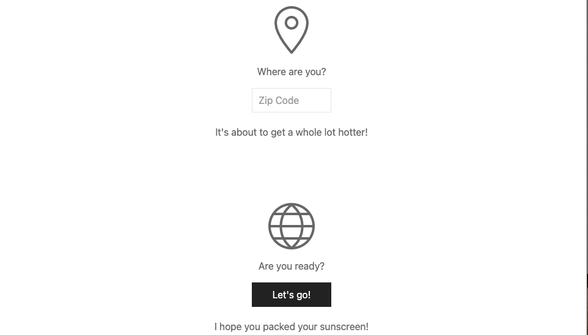
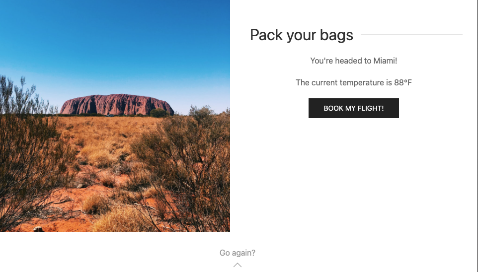

# GTHO-Travel-App

## Description
Get Me the Hell Out of Here is a travel application that utilizes flight, location, and weather APIs to provide the user with flight information for the hottest travel destinations. The user enters their zip code and GTHO returns the next departure from their nearest airport headed to the warmest destination in a 500 mile radius.

## Screenshots

## Link to Deployed Application
[Get Me the Hell Out of Here](https://michalakisluke.github.io/GTHO-Travel-App/)

## Technologies Used
### APIs
* Aviation Reference Data API
* Open Weather API
* Skyscanner Flight Search API

### Libraries
* Jquery
* Moment
* UI Kit

### Technologies
* HTML
* CSS
* Javascript

## Authors & Acknowledgements
* [Jacob Machlis](https://github.com/flumanuck)
* [Luke Michalakis](https://github.com/michalakisluke)
* [Sarah Dickinson](https://github.com/sarahdickinson)
